## 10 Logistic Regression

<!-- more -->

### Logistic Regression Problem
我们学习过了Binary Classification和Linear Regression问题。对于二分类问题，只能对类别进行区分。例如：如果我们现在有一些病人的数据，我们想要学习病人患心脏病的情况，Binary Classification只能学习到是否会患病。如果我们不仅仅需要Learning到病人会不会患心脏病，还需要知道他患病的概率是多少，此时Binary Classification就不能胜任了。对于这种任务我们通常称之为‘Soft’ Binary Classification，其一般形式如下：
```
f(x) = P(+1|x) ; 
```
其输出是一个属于0到1区间内的小数，表示发生+1的概率。

我们想要做到Learning，那么理想的数据（没有噪音）应该是对于每一个输入x，都对应其发生的概率p。然而，实际在我们的数据（含有噪音）上，对每一个输入x，我们只知道它是正类还是负类，我们的数据和Binary Classification是相同的，因此我们需要一个不同的目标函数，我们仍然将输入各个维度的特征乘以权重，当其值很小的时候，输出接近0，相反则接近1:

<div align=center> 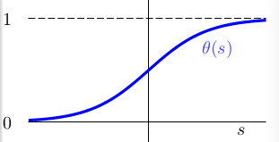 </div>

我们称其为logistic function θ(s)，其中s为sum（wi \* xi) (from 0 to d)，xi为每个输入特征，wi为对应的权重，而第0维度是threshold。使用向量表示：

<div align=center>  </div>

而为了实现这样的效果，θ(s)实际上如下：

<div align=center> 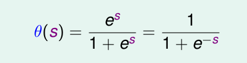 </div>

这个函数也被称为sigmoid方程。我们将以上的结果整理，得到了Logistic Regression的h(x):

<div align=center> 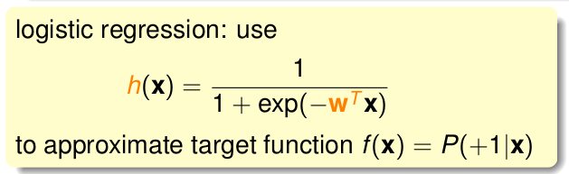 </div>

### Logistic Regression Error
现在我们比较我们已经学习过的三种Learning方法：

<div align=center> 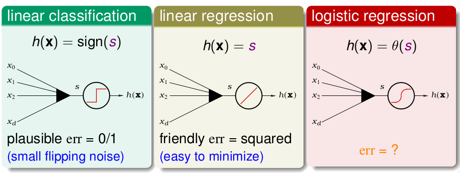 </div>

三种输入都是d+1维的向量。Linear Classification使用了sign函数，将输出空间限制在{-1， +1}，也因此使用了0 1误差；而Regression问题则直接将和权重计算后的结果输出，其使用了平方误差；而Logitstic Regression使用了sigmoid函数，来获得事件发生的概率，那么该怎样定义它的Error Function呢？

我们首先看我们的目标函数f，其等于P(+1|x)， 其意义就是任意数据x发生+1的概率是多少。我们反过来看P(y|x)，如果y = +1时，那么它就等于f(x)，相反，如果y=-1，其值为1-f(x) （注意：因为概率值为0到1之间的数）。
现在我们考虑我们有一堆数据，其既有+1情况的数据，也有-1情况的数据，如果我们用f去生成这些数据，以及用我们的假设h生成这些数据：

<div align=center> 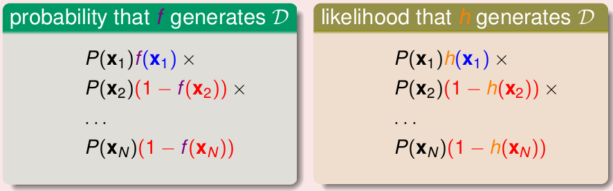 </div>

如果我们得到的h和f相差不大，那么生成的差不多的数据的概率也是差不多的，当然这里有个前提是这个数据量很大。我们想在的任务实际上就是找到这个和f相差不多的函数g，那么g：

```
g = argmax(likelihood(h))
```

我们知道，在logistic中，h(x) = θ(wTx)，同时1-h(x) = h(-x)（可以根据sigmoid曲线看出）。所以将其代入到likelihood(h)中，我们知道：

<div align=center> 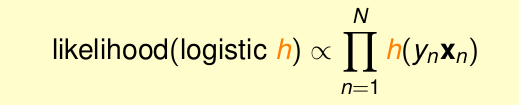 </div>

既然是正比关系，我们可以对右边表达式取ln，同时，取最大值情况相当于加负号后取最小值，由此，我们能够整理出Logistic Regression的Error Function：

<div align=center> 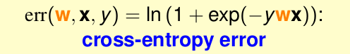 </div>

### Gradient of Logistic Regression Error
既然要Learning，我们就需要最小化Ein(w)。我们知道Linear Regression问题的平方误差是一个平滑连续的凸函数，所以我们能够使用在梯度为0处是最小值这个技巧来求最优解。当然实际上logistic的Error同样是一个平滑的凸函数，我们可以求得令∇E in (w) = 0处的w即可。

<div align=center> 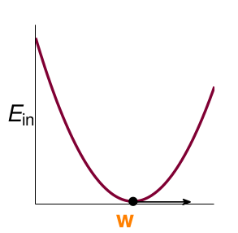 </div>

可以使用链导法对其求导（过程略），最终结果如下：

<div align=center> 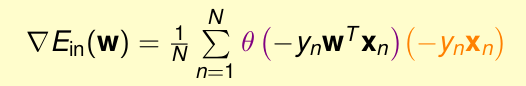 </div>

然而，我们发现求解梯度为0并不是一件简单的事情，那该怎么办呢？此时我们回顾我们的PLA是如何找到最佳的分类直线的：

1. 找到一个错误点。
2. 使用错误点纠正w，令wt+1 = wt + yn\*xn。
3. 重复1、2直到停止，此时找到最优w。

我们着重看第二步：

<div align=center> 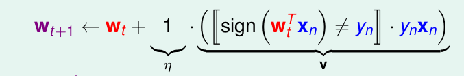 </div>

实际上就是每一次都在接近最优的解。我们也可以类比这个思想，当我们在最小化logsitic error时，我们每一次选择一个方向向量v和一个η(步长)，来向更小的方向迈出一步即可。

<div align=center>  </div>


###  Gradient Descent

对于上面所提出的方法，实际上包含一种贪心的思想，此外，当我们使用的步长数值η比较小时，我们可以将Ein用泰勒展开:

<div align=center> 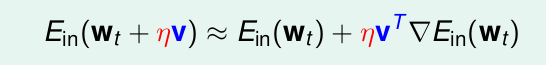 </div>

从而我们的一种解决方法如下：

<div align=center>  </div>

对于v的选择，实际就是Ein梯度的反方向：

<div align=center> 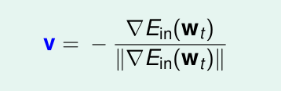 </div>

我们把这种方法称为梯度下降（Gradient Descent）：每一次选一个较小的步长，向梯度下降的方向移动，直到移动到最低点为止。

其中η被称为学习率，它决定了学习的速度。在学习中需要选择适当的学习率，过小则会导致学习速度过慢，过大则会产生震荡现象，不稳定！一个好的方法是使用变化的learning rate，在梯度较大处使用较大的lr，然后随着学习的进行逐渐减小：

<div align=center> 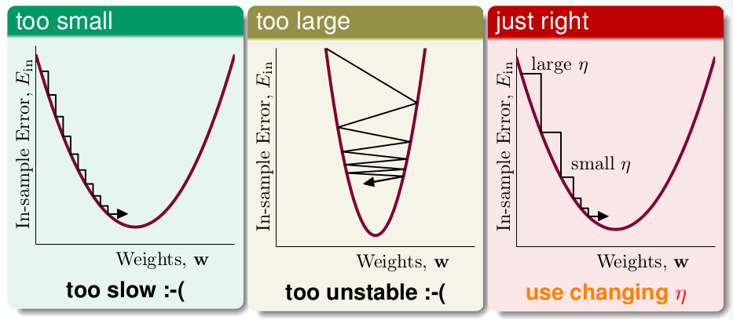 </div>

现在我们对于一个logistic regression，总结如下：
1. 初始化w0。
2. 计算Ein(wt)的梯度。
3. 使用梯度下降的方法update wt。
4. 直到梯度减小为0时停止，此时wt+1对应的g就是我们所需要的。


> 文章内容和图片均来自“国立台湾大学林轩田老师”的《机器学习基石》课程！

--- END ---
