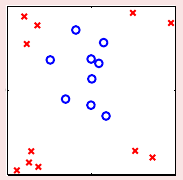
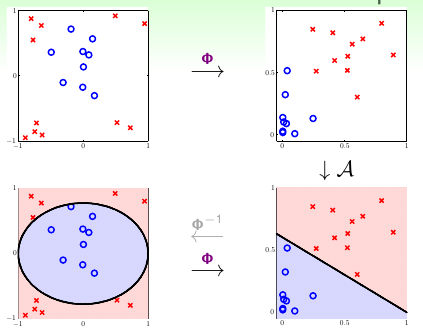
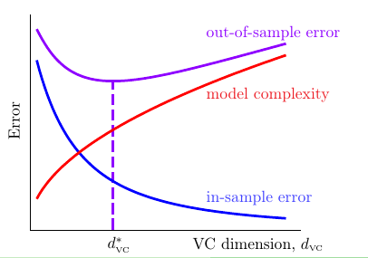

《机器学习基石》系列课程（十二）

我们学习过线性分类模型，现在我们将学习非线性模型！

<!-- more -->
## Quadratic Hypotheses
到目前为止，我们所学习的都是线性分类模型，对于这些模型，我们通常可以找到一条线（或超平面）将我们的数据分为两个部分，我们只需要对每个数据点算一下分数就能实现这一点。

但是这样的模型是受限的！在理论上，我们使用的线性模型，VC维度是比较小的，但是实际上我们会遇到一些数据，这些数据对于线性模型是不能做到区分的，那么此时我们不论选择假设空间中的哪一条线，其Ein都会很大！

  

此时我们该怎样突破我们的线性模型所带来的限制呢？举个例子，对于上面的分布数据点，一种直观的想法是：我们使用一个圆圈来对数据进行区分：

  

此时数据点集D虽然不是线性可分的，但是我们仍然可以使用一个圆来区分这些数据。那么我么只要看一看点是否在圆的内部即可，假设这个圆形的半径是sqrt(0.6)，此时我们的h(x):

  

就像上面所说的，我们的一些数据尽管不能使用线性模型来分开，然而我们可以使用圆形来分开，同样我们也能用同样的方法来实现圆形的线性回归以及圆形的Logistic Regression。然而，如果只是这样简单地将其推广，还是很麻烦，我们需要一个一个地去重新推导，现在我们从另一个角度来看这个问题：

  

我们将h(x),整理为如上的形式，如果我们将每一个平方项都用zi表示，系数用wi表示，将圆形半径作为z0，并将其乘以1作为z0。此时，是不是有似曾相识的感觉？

没错，这就是线性模型的一般结构，或者说，我们的数据看起来是不能线性分开的，但是如果我们将每一个数据点都转换到z空间，那么这些数据就变成线性可分的了：

  

然而，我们现在的转换还是受限的，虽然随着参数的不同，我们在z空间上的线性模型可以表示为当前空间中的不同曲线模型（圆形分类模型、椭圆分类模型、双曲线分类模型），然而，你能不能做到一个圆心不在原点的圆形分类模型吗？答案显然是不能的，因为我们的h(x)中没有包含一次项，也就不能对其进行平移变换。如果我们需要一个包含所有曲线的二次Hypothesis该怎么办？简单的想法就是将所有的项都添进去，包括常数项、一次项、二次项（包含两个未知数的乘积）。

  

其中Φ2为：

  

## Nonlinear Transform
现在通过空间的变换，我们将我们有的不能线性分开的数据转换到能够线性分开的z空间上。我们希望在z空间上也有一个Good Perceptron能够将数据分开。然而我们现在只知道在x空间上怎样对{(x, y), ...}这样的数据分类并获得一个Good Perceptron。那么我们现在要做的是对z空间上的数据{(zn=Φ2(x), y), ...}寻找一个Good Perceptron。

我们可以这样考虑：
1. 将原始数据转换到z空间。
2. 在z空间上得到一个Good Perceptron，此时可以使用任何一种线性分类算法。
3. 将z空间上的Perceptron转换回x空间。

  

使用上面的方法，我们就能够很轻松地实现在二次空间上的PLA、Regression等算法了。

实际上特征转换的思想我们并不陌生，在第三章我们介绍各种特征（具体特征、原始特征、抽象特征等）时，我们就接触了这种思想：对于手写数字，我们知道的是每一个数字的各个位置的像素灰度数值，我们可能可以将这些raw feature转换为平面密度和对称性等来实现对数字的分类和识别！

## Price of Nonlinear Transform
现在我们将上述方法推广到n维（上面介绍的是利用二次曲线来分开平面上的点，现在我们使用n次曲线同样实现这件事），如果我们需要Q次的变换：

  

如果我们的hypothesis能够包含所有的q次曲线，那么需要将所有可能的项都包含进来，此时，我们使用排列组合的知识，能够知道此时这个h(x)的维度的复杂度是O(Q\*\*d)。此时我们可以知道，不论我们是使用PLA还是其他的模型，我们都需要大量的时间来更新参数，同时，也需要更大的空间来存储这些参数。如果Q越大，那么计算和存储这些参数所需要的代价也就越大！

  

同时，也代表此时的VC dimension也是至少d̃ +1这么大，随着q的增加也越来越大。但是我们可以证明此时的Dvc最多是d̃ +1，因为在z空间上任何d̃ +2个点都不能被shatter，那么在x空间上同样如此。

那么Q变大，VC Dimension也变大有什么坏处呢？通常q次数越高，我们很容易让Ein变得很小，但是却很难让Eout和Ein相等。如果q的次数很小，我们能够做到Ein和Eout相等，但是却很难让Ein变得很小：

  

我们该怎样选择一个合适的q呢，很明显，q既不是越大越好也不是越小越好！那么能不能使用人眼来选择呢？
首先，对于高纬度空间，人类是很难对其进行想象的。其次，就算是一个比较低的纬度的空间，我们这样做往往会也会带来一些风险：我们人脑会首先对这些模型进行优化，然而我们在计算时却忽略了我们自己优化所带来的代价，这些代价可能很大，从而会对q的选择带来影响。

## Structrued Hypothesis Sets

现在我们重新看一看我们的转换过程。

  

我们列举了从0次到Q次的转换，通过观察这些转换方程，我们可以推断出，所有低次的变换都是高次变换的特例，我们可以用一张图来表示：

  

我们把这种关系称为假设空间H的结构。对于这些假设空间之间的关系，我们可以使用一张图来概况：

  

即随着维度q的增大，VC Dimension逐渐增大，而其Ein能获得的最小值则越来越小。实际上此时随着维度的增大，其Ein、Eout和模型的复杂度之间存在这样的关系：

  

对于这张图我们已经不陌生了，这也就说明，更高维度的模型其复杂度也越高，虽然我们在高维模型可以获得好的Ein，但是我们真正关心的从来都不是Ein，而是Eout。此时模型的复杂度很高，我们却很难获得好的Eout！

由此，我们的学习一般不能从一个很高的维度开始，否则我们可能根本无法优化。一般我们都会从线性模型开始学习，它是简单高效安全的，实际上，很多时候线性模型就能取得很好的效果！

> 文章内容和图片均来自“国立台湾大学林轩田老师”的《机器学习基石》课程！

--- END ---