《机器学习基石》系列课程（十四）

本章学习应对Overfitting问题的一种方法：正则化（Regularization）。
<!-- more -->

## Regularized Hypothesis Set
当我们在Leraning中，如果使用了能力更强的模型，或者数据中包含一些噪音（stochastic or deterministic noise），或者训练数据的数量太少的时候，Overfitting就会发生，如图，其中就是试图使用一个高次的模型去fit一个2次的目标函数，尽管我们的数据点都在预测的模型曲线上，然而它与目标函数的距离还是很大：

 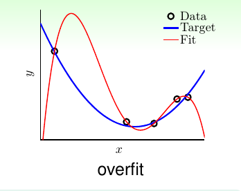 

我们要解决overfitting问题，就是要把上面的红色曲线修正为下图这样：

 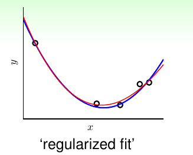 

我们的一个想法是将我们所使用的高次的假设空间一步步移动到低次的假设空间，例如从10次的假设空间H10‘step back to’H2。那么该怎样做呢？

我们已经知道，低次的假设空间是高次的一个子集。那么如果想要将高次的变为低次的，只需要将假设函数中对应的高次的系数变为0即可：

 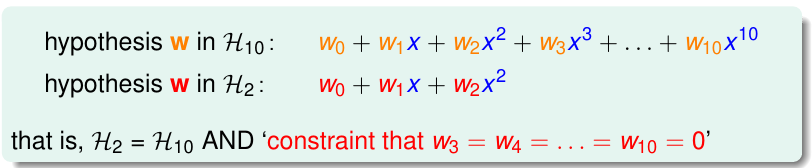 

看到这里也许你会有一些疑问，为什么不直接使用低次的假设空间H2，反而绕来绕去，让H10中大于等于3次幂的项的系数等于0呢？其实这只是为了方便后面的论证而已！

我们继续来看这个问题，前面我们说让高次（大于等于3次幂）的项的系数变为0，我们能够从H10回到H2，现在我们假设我们有这样一个假设空间，我们只需要保证其中系数不等于0的幂次的数目小于等于3。或者说，之前我们对0次，1次，2次项的系数不做要求，让其他项的系数统统为0，现在我们不为零的项可能是1，可能是5，也可能是10，只要总数小于3就行了。

 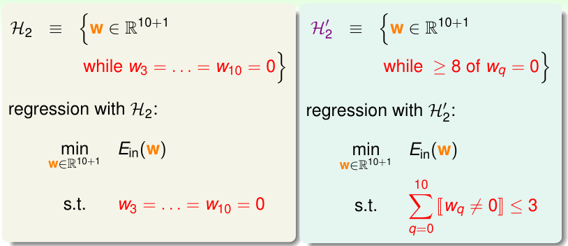 

此时我们可以确定的是，我们之前用的假设空间H2一定是现在这个假设空间H2'的一个子集，并且相对于H10来说，它发生Overfitting的风险要更小！

然而，H2'这个假设空间看起来效果很好，但是解决它却是NP Hard的问题，这仍然很糟糕，那么我们继续思考，能不能将其中的限制再放宽（softer）一些呢？

现在，我们令一个新的假设空间为H(C)，它仍然是基于H10，但是与之前所有的假设不同的是，我们不强制让某些项的系数为0，反而来计算所有项的平方和，令其小于等于C：

 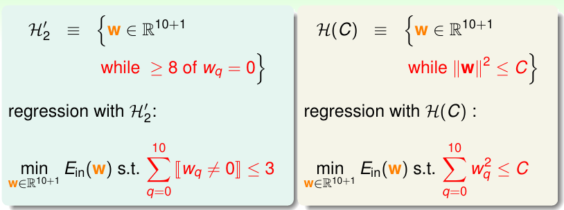 

此时，H(C)与H2'是有一定重合的，当并不完全相同。当我们对C取不同的数值时，我们能够保证这样一件事：

 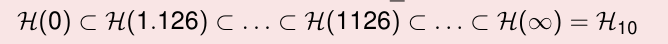 

也就是当我们的C取很小的数值时，我们就相当于对H10添加了很大的限制，如果很大，甚至到无穷，那么就说明我们对H10添加了很小的限制，甚至没有限制！

我们将这个H(C)称为regularized hypothesis，此时如果我们能够找到一个很好的权重向量解决这个问题，我们将这个权重向量称为Wreg

## Weight Decay Regularization
我们首先将Regularized Regression用矩阵表示：

 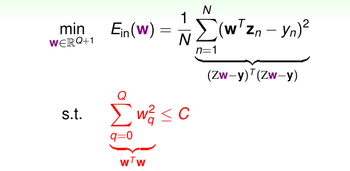 

其Ein(w)表示如图，其约束条件是各个weihgt的平方和小于C，实际上，如果我们将所有的weight看成是一个w向量，那么就可以看作是wTw小于C！

从几何角度来看，我们理解为wTw是高维空间的一个球体内部所包含的区域，其半径为C的平方根。我们解决这个问题，可以使用拉格朗日乘数法(Lagrange Multiplier)，也就是，我们在wTw <= C的条件下，最小化Ein(w)：

 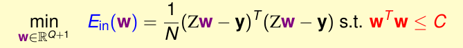 

现在我们考虑这个优化过程，我们使用下面的图来说明这个问题（注意，蓝色线和红色线其实表示的是球体，这里为了可视化而简化了）：

 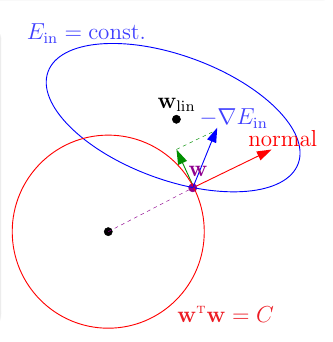 

首先，我们使用梯度下降的方法来寻找Ein(w)最小的时候w的值。就像上图那样，如果我们不加任何约束条件，我们找到的最终的结果是Wlin（在蓝色圆中心的黑点）。然而，我们现在能够搜索的w是受限的，我们只能在红色的球壳包围的区域寻找这个w，在红色球壳上的任何一个w，都满足wTw = C。那么我们从球壳内部任意点开始进行梯度下降，如果我们到了球壳的边缘，就不能继续沿着球体的法线方向走了，否则将不满足约束条件。我们只有沿着此时负梯度方向沿着垂直于球体法线的方向走。如果最后负梯度方向和法线方向平行，则说明此时找到了目标的规则化权重Wreg。

概况来说，求解这个问题，寻找到和负梯度方向平行的Wreg才是最终的结果，我们可以用数学方法来表达：

 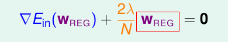 

其中参数λ > 0，添加的常数2是为了后面的计算简便（公式表明了wreg和负梯度方向相同）。

那么现在我们想办法来解这个方程，从而求得Wreg。
如果λ>0是成立的，那么实际上这只是一个线性方程，未知数只有一个Wreg：

 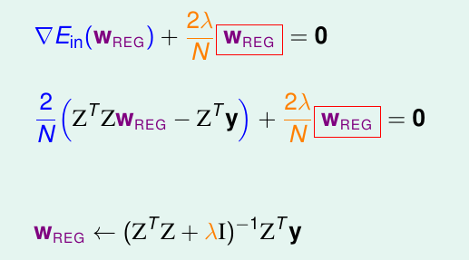 

从另一个角度来考虑，如果λ>0，我们解这个方程，我们只需要对其积分即可，也就是说，我们只需要求解下面这个表达式最小化即可：

 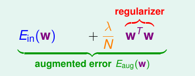 

这两个表达可以通过积分求导变换而来！所以现在通过最小化Eaug(w)(λ >= 0, 注意是可以等于0的，等于0相当于没有添加正则化项)来求得Wreg，这要比去最小化带着常数C的Ein要有效！

然而，λ的值又该怎么办呢？我们先代入不同的数值来看一看在本章最开始的例子的表现如何：

 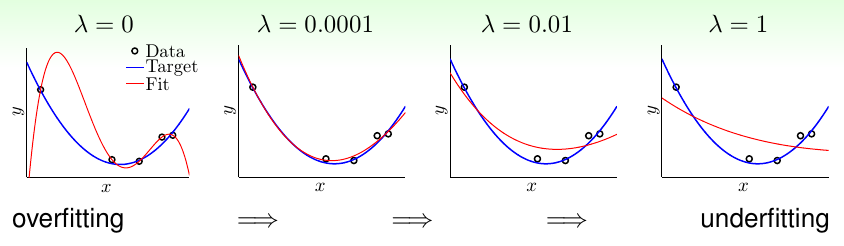 

可以看到，随着λ的增大，我们的模型从Overfitting逐渐变为Underfitting。我们的w的维度更短，相当于使用了更小的C(对于H(C)而言)。

然而我们忽略了一个问题，对于我们一直所说的polynomial transform，如果我们的x很小，在-1到1之间，那么如果x的次数变高之后，得到的数值就会非常小，那么我们就需要更大的w。所以为了解决这个问题，我们需要选择一些正交的项（Legendre Polynomials）作为基底：

 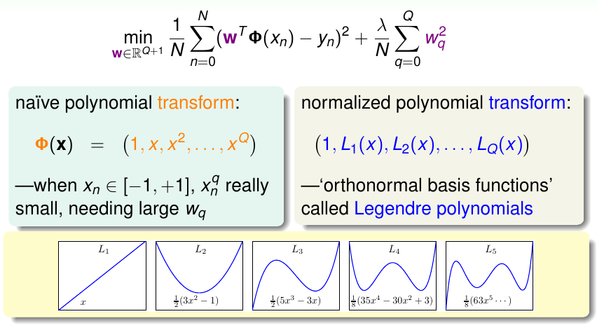 

## Regularization and VC Theory
现在我们来看看Regularization和我们之前学习过的VC Bound有什么关系。

 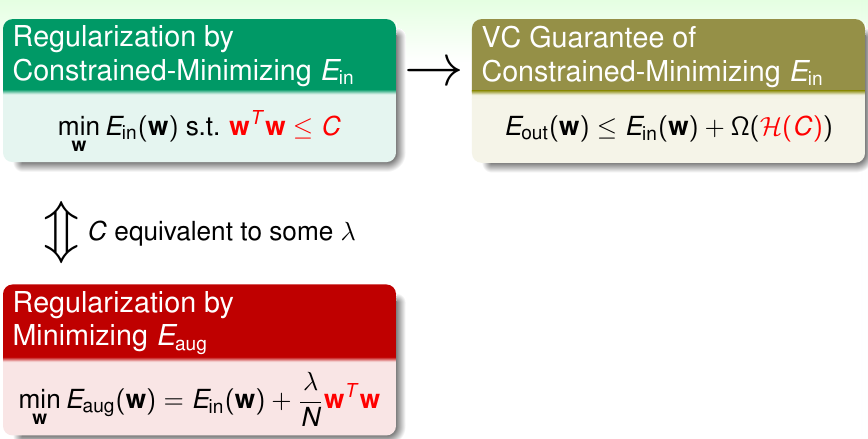 

我们的原始问题是要最小化带有常数C的Ein，然而我们偷懒只求解了Eaug，其是λ>=0的情况。对于我们的原始问题，实际上它对应了VC的一个Guarantee：就是Eout要小于等于Ein和Ω(H(C))的和。

我们求解Eaug，实际上就在间接地把VC Bound做好！但是实际上我们在求解时并没有真地限制在H(C)上，我们还是考虑了所有的w（从某种角度来说），只是最后我们使用了w的一小部分来看看VC的Guarantee是什么。

Augmented Error和VC Bound存在一些异同。

 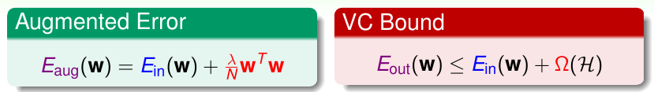 

对于regularizer wTw来说，其代表了一个hypothesis有多复杂，而Ω(H)则表示了一整个Hypothesis Set的复杂度。VC和Augment Error做的事情不太一样，但是他们都在计算某件事情的复杂性。
如果单一的Hypothesis的复杂度和整个Hypothesis Set的复杂度差不多，或者说前者能够表示后者，那么也就说明Eaug可以使VC Bound中Eout和Ein很接近。

在以前，我们将Ein做好来保证Eout的效果，现在我们通过做好Eaug来做好Eout，而且，它比Ein要更擅长这件事。

另一个角度是这样：

  

我们看Eaug，要知道模型的复杂度到底是多少，那么因为所有的w都是可以选的，所以理论上dvc(H) = d + 1（z空间的自由度）。但是我们只需要在H(C)里选，所以代价只有dvc(H(C))这么大。

对于原有的假设空间H，它的VC Dimension很大，但是通过正则化，我们能够将其复杂度限制在effective VC dimension这么多，而且有可能它会比原来小。

## General Regularizers
我们希望将Regularizer一般化，一个好的regularizers应该有这样的特性：
1. 和目标函数有关。
2. 能够选出更平滑更简单的。
3. 容易获得最优化结果。

我们不用担心regularizers会带来坏的结果，因为λ可以等于0，此时和没加正则化的效果是相同的，也因为有这个保证，我们的模型不会更差。
在这里有两个regularizer：

1. sparsity(L1) regularizer，是所有的权重绝对值的和，是稀疏的，可能有很多0，但是获得最优解可能比较困难。如果我们需要稀疏的解决方法，L1是有用的。
2. weight-decay(L2) regularizer，是所有权重的平方和，容易优化。

最后看一看noise对regularization的λ的选择以及Eout的关系：

 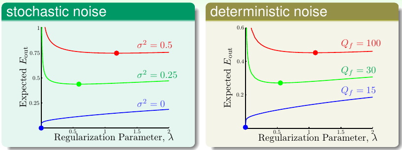 

> 文章内容和图片均来自“国立台湾大学林轩田老师”的《机器学习基石》课程！

--- END --- 