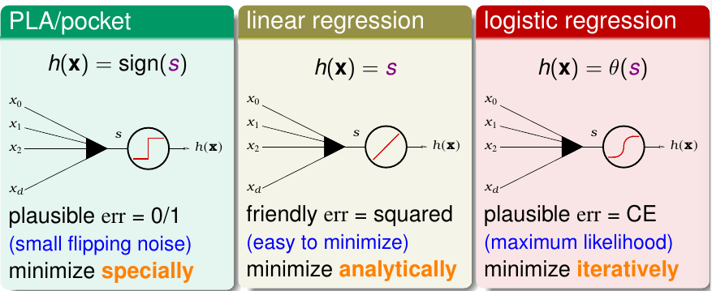
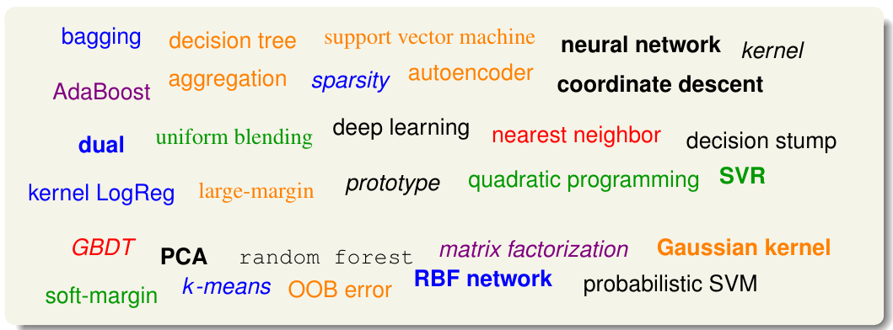

《机器学习基石》系列课程（十五）

基石最后一课，技法见！
<!-- more -->

## Occam's Razor

> entia non sunt multiplicanda praeter necessitatem (entities must not be multiplied beyond necessity) — William of Occam (1287-1347)

> 如无必要，勿增实体！

奥卡姆剃刀定律告诉我们能够fit数据的最简单的模型是最好的。那么什么是简单？其有两方面的解释：

1. Hypothesis h是简单的，也就是它有较少的参数。
2. Hypothesis Set H是简单的，其包含的hypothese较少，模型的复杂度更低。

简单的更好，我们可以从数学上进行证明（比如VC理论）。同时，我们也可一这样思考：一个更简单的H，它的成长函数更小，也就从而从概率上来讲就很难完美地fit我们的数据。反过来说，如果我们真的找到了能够fit数据的h，那么往往这个h就很有意义。

## Sampling Bias
解决Learning问题过程中要注意数据抽样的分布。如果我们的数据在抽样存在偏差，那么我们学习到的结果也就会存在偏差，从而导致学习的效果很差！

因为真实的数据的分布是P1(x|y)，但是我们学习（或者在模型选择过程）是在P2(x|y)上完成的，P1 != P2，那么我们的VC保证也就失败了，导致Ein和Eout相差很大，学习失败！

同时，我们也要关心真实的数据应用场景，我们未必一定采用随机采样才是最好的方法，要根据实际的测试数据的分布来决定！
## Data Snooping
我们在Learning过程中不能"偷看数据"，如果我们这样做了，就不能保证VC是安全的。一方面，我们训练模型和选择模型过程不能使用测试集，否则虽然结果看起来很好，世界上测试结果根本没有意义。另一方面，如果针对相同的问题，前人做出了结果，但是比做的更好，在这个过程中实际上我们在一定程度上也偷看了数据，因为我们"站在了巨人的肩膀上"了！
实际上这个问题很难避免，这里有一些建议：

1. 完全不用测试数据。
2. 使用验证集，但是也要小心使用。
3. avoid making modeling decision by data，尽量使用我们的知识和常识来选择模型。
4. 保持怀疑。就是说时刻保持对别人的论文或者研究成果保持警惕与怀疑，要通过自己的研究与测试来进行模型选择，这样才能得到比较正确的结论。

## Power of Three

本课程结束，这里是一些总结：

本课程介绍了3个相关领域：

1. 数据挖掘。
2. AI。
3. 统计学。

介绍了3种理论方法：

1. Hoeffing：通常用于验证和测试假说。
2. Multi-Bin Hoeffding：用来验证多个Hypotheses。
3. VC理论：用于training，为Ein约等于Eout给了理论保证。

介绍了3中模型：

1. PLA和Pocket。
2. 线性回归。
3. 逻辑回归。

  

介绍了三种工具：

1. 特征转换：使用高维空间使Ein更小，但是会导致vc维度变大，模型复杂度增大。
2. 正则化（Regularization），用来降低模型的复杂度，使其实际的vc维度要更低，不过会导致Ein增大。
3. Validation。

还有今天将的3个技巧和准则：

1. 奥卡姆剃刀。
2. 抽样偏差。
3. Data Snooping。

接下来，还有更多的内容要去学习，加油！

  

> 文章内容和图片均来自“国立台湾大学林轩田老师”的《机器学习基石》课程！

--- END --- 