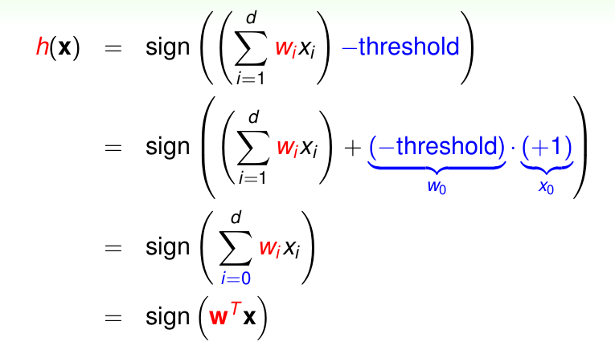

《机器学习基石》系列课程（二）
我们已经知道，机器学习模型由两部分组成：演算法和Hypothesis Set。如果我们想要让计算机学习去回答答案为是、否这样的问题时（就像第一章中的信用卡发放的问题那样），我们需要怎样的演算法，我们又应该使用什么样的hypothesis set呢？
<!-- more -->

## Perceptron Hypothesis Set
有一种简单的Hypothesis Set可以做这件事，这种Hypothesis Set是the Perceptron。
我们仍然以银行是否发放信用卡为例子，我们令每一位顾客的信息为x，其中：
```
x = (x1, x2, x3, x4, ..., xd)
```
即针对该任务，需要考虑d个用户的特征。我们需要学习一个权重向量（决定这d个特征那个更重要）w：
```
w = (w1, w2, w3, ..., wd)
```
我们设定一个阈值threshold，当所有特征和权重乘积的和大于threshold时，可认为是被接受的，否则则是被拒绝的。用数字来表示可以认为前者为1，后者为-1。用数学表示该公式为h(x):
<div align=center></div>
当然我们还可以将上面的公式进一步化简，即将threshold当成一个属性，其权重为1，然后我们将它用向量来表示，具体过程如下：
<div align=center></div>
这样做以后计算过程就变成了两个向量的内积了

上面描述了Perceptron function是什么，那么它们长什么样子呢？在R2（二维空间）中：
```
h(x) = sign(w0 + w1 * x1 + w2 * x2)
```
其实就是一条直线，可以将平面上的点分为两部分。而在更高维度的空间上，其表现为一组超平面，可以将空间内的点分为两个部分。最终我们需要另接受的点在直线（超平面）的一端，被拒绝的点在另一端。

## Perceptron Learning Algorithm
Perceptron Hypothesis Set中包含了无数条（infinite）直线（或超平面），我们需要从中选出一条最适合的'g'。我们不知道f，唯一知道的是数据是由f产生的，理想中的g必须让我们看过的资料的结果和f产生的一模一样。但是g太多了，计算起来太困难了。
我们的一个解决方法是从任意一个g0开始（其权重为w0），每次调整使其越来越好，最终找到一条没有更多错误的g。
例如：我们由w0开始，使用数据集中犯错的点来纠正它。当我们的向量是wt时，我们发现一个错误点是(xn, yn)，sign(wt \* xn) != yn; 此时我们的纠正方式如下：
<div align=center></div>
上述方法的本质是让每一次w的更新都能使得直线向正确的方向移动。最终找不到更多错误的时候就找到最终的g了。

## Guarantee of PLA
然而，我们面临的一个问题是PLA真的能顺利进行吗？PLA如果最终能够停止（找到了最好的g），那么前提条件是数据集必须线性可分（Linear Separability），我们假设我们所给的数据集是线性可分的，那么此时我们能否证明PLA一定可以停止吗？
可以这样思考，当存在一个完美的wf，使得yn = sign(wft \* xn) (wft是wf的转置),此时得到的g就是最好的。此时必定满足：
<div align=center></div>
此外，从数学的角度说，两个单位向量内积越大，则说明两个向量越接近。那么有下面的计算：
<div align=center></div>
可以说明，每一次更新wf和wt的乘积都是越来越大的（注意：因为没有考虑wf和wt的长度，所以此时不能说明wf和wt是在靠近）。因此我们考虑PLA算法的一个重要的性质：仅仅针对错误点更新，因此，必定有：
<div align=center></div>
我们再看wt+1是什么样子的：
<div align=center></div>
可以说明wt增大缓慢，成长值只会受到xn项影响。xn \*\* 2最多长max||xn|| \*\* 2。我们计算将wf和wt正规化后内积：
<div align=center></div>
随着次数的增大，越来越大，即使wt和wf越来越靠近。因此对于线性可分的数据PLA最终是可以停止的。

## Non-Separable Data
我们已经证明了，在数据是线性可分的前提下PLA算法是可以停止的，PLA算法好处是简单快速，几十行代码就可以搞定，对任意维度的数据都是有效的。但是你有没有发现矛盾的地方？
前面，PLA执行的前提是假设数据线性可分，那到底可不可分，我们需要做了实验才知道，可是做了实验又多久会停止？没停止可能是没有找到最好的g，也可能是数据根本不可分。那么怎样在一个含有噪音的数据集上寻找到一条犯错最少的线（定义为最好的线）呢？目前没有最好的方法，这是一个np难的问题。
我们可以使用Pocket Algorithm，它是PLA的一个变形，根本上是一种贪心的思想，每一次都keep best weights in pocket。直到看过了足够多的线，就认为它是最好的。

但是Pocket Algorithm要比PLA慢。

> 文章内容和图片均来自“国立台湾大学林轩田老师”的《机器学习基石》课程！

--- END --- 
