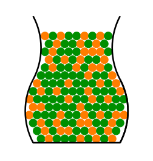
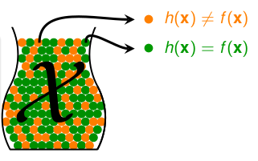
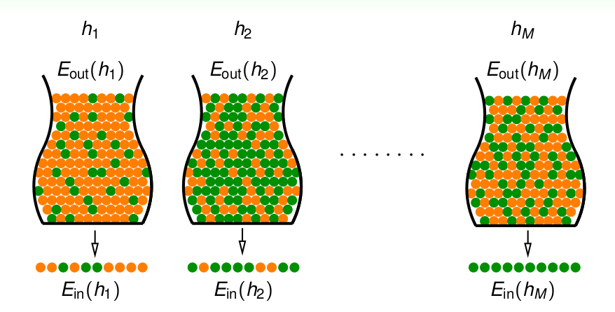
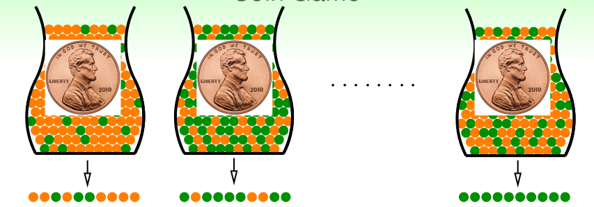
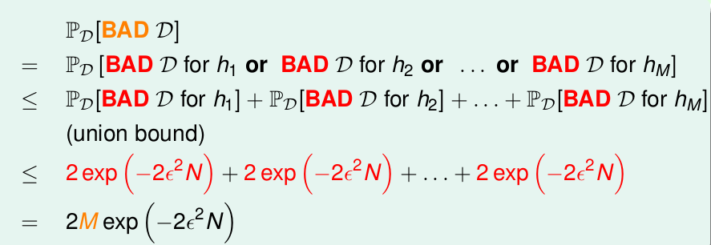

 
《机器学习基石》系列课程（四）

<!-- more -->

## Learning is Impossible?
虽然我们已经学习了PLA，并使用PLA尝试回答是否问题，但是有一个惊悚的问题我们可能并没有发现：如果对学习没有添加任何限定，Learning可能是做不到的。我们总是在根据有限的数据来选择g，然而对于选择出的g，我们真的能够说g和f最相似吗。这显然是不能的。
机器学习中有“No Free Launch”定理，其指出我们没有理由得出对我们已有经验物体之外的推理。
那么我们需要添加怎样的假设能够让Learning在理论上可以进行呢？

## Probability to the Rescue
我们可以从其它场景入手，推论出一些未知的关系：

  

我们可以想象有这样一个瓶子：
1. 瓶子中有很多橘黄色和绿色的弹珠。
2. 我们现在并不知道两种颜色弹珠的数量所占的比例。

我们能不能通过从瓶子中随便抓一把，从而推断出瓶子中橘黄色弹珠所占的比例呢？（假设弹珠很多，难以计数）。为了表示简单，我们假设：

1. 橘黄色的弹珠所占的比例为u，u是未知的。
2. 绿色的弹珠所占的比例为1 - u。
3. 我们从瓶中抓出一把中橘黄色弹珠所占的比例为v。
4. 抓出的绿色弹珠比例为1 - v。

现在问题就转换为了u和v是否相等的问题了。然而，二者可能不相等，因为可能抓出的都是绿色，而瓶子中都是橘黄色的；当然，也可能u和v是很接近的。那么一般来讲，v是否能够表示u呢？为了解决这个问题，我们需要使用到霍夫丁不等式（Hoeffding's Inequality):

  

该不等式说明了这样一个问题：对于一个很大的N，v和u相差很小（绝对值小于e)。那么根据这个不等式，我们也可以说，当从瓶子中抓取的弹珠很多的时候，v和u相等是大概率可能正确的（PAC：probably approximately correct）。

## Connection to Learning
在上面，我们针对有橘黄和绿色弹珠的小球的比例估计问题，使用hoeffding不等式说明了在N足够大的情况下，是能够说明u和v相等是PAC。然而这听起来和我们所要探索的Learning问题没有什么关系。实际上我们可以将Learning问题类比为瓶子弹珠颜色概率问题：
我们现在仅仅考虑一个确定的hypoothesis h(x)，我们所要证明的是h(x)和目标函数f(x)是否相同。我们现在假设有这样的一个瓶子，其满足以下要求：

1. 瓶子中每个球都是一个数据x。
2. 对瓶子中任意一个球x，如果h(x) == f(x)，那么这个球就是橘黄色的。
3. 对瓶子中任意一个球x，如果h(x) != f(x)，那么这个球就是绿色的。

  

我们所需要验证的是，当瓶子中的数据数目N很大时，瓶子中的橘黄色球的比例和不在瓶子中的橘黄色球（瓶子中只是我们用来学习的数据，瓶子外还有很多未知的数据）的比例相等这个事件是否PAC。
为了方便后续的表示，我们定义两个变量：Ein(h)和Eout(h)，分别用来表示已有数据内的错误概率和未知数据的错误率。

  

那么类比上一部分的小球实验，对于一个确定的假说h，在“big data”的条件下，根据霍夫丁不等式，我们可以推论出Ein(h)和Eout(h)是很接近的。

  

那么，如果我们选择一个Ein(h)很小的假说h，我们就可以说 “g = h”是PAC。也就是说，在Learning中，在我们已有的数据上g和f是接近的，那么在未知的数据上，g和f很接近是PAC的。

## Connection to Real Learning
不过在实际学习任务中，h并不是确定的，我们有很多很多的h等待我们去选择。

  

在这种情况下，如果我们验证的所有假说h中有一个hM竟然能够达到最佳的效果（全是绿色的球），但是实际上瓶子中还是有大量的橘黄色的球, 或者说Ein(h)和Eout(h)相差很远。这时候我们根本不能认定这个假说hM是最好的。这件事在概率上是很有可能发生的，而且还是有很大概率会发生的。举个例子，我们的瓶子中不再放球了，而是放硬币：

  

那么如果每次抛5次，一共抛150次，我们可以计算出出现5次一样的面的概率竟然是99%。
霍夫丁不等式只是保证了绝大部分是对的，但是仍然会存在坏的现象，只是几率很小而已。而我们的选择则进一步恶化了这种几率。
对于出现上述情况的数据，我们将其称为BAD DATA，也就是说，只要存在一次BAD，那么这些数据就是BAD。我们只有在没有BAD的数据中Learning才能得到正确的结果。
我们从hoeffding不等式可知，这些BAD的数据出现的概率是很小的，

  

在我们的演算法自由自在选择数据时候，总共的BAD数据出现的概率：

  

可以得出，其也是很小很小的，因此在有限的h中，不管M、N是多少，选择h都是安全的。也就是在有限的h中，数据足够多，我们就能学习！也就是在这种情况下，机器学习是成立的。

> 文章内容和图片均来自“国立台湾大学林轩田老师”的《机器学习基石》课程！

--- END --- 