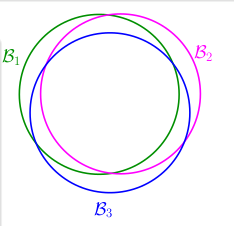
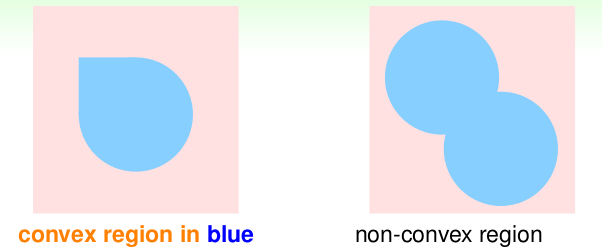
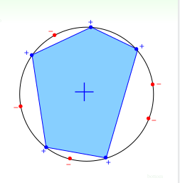
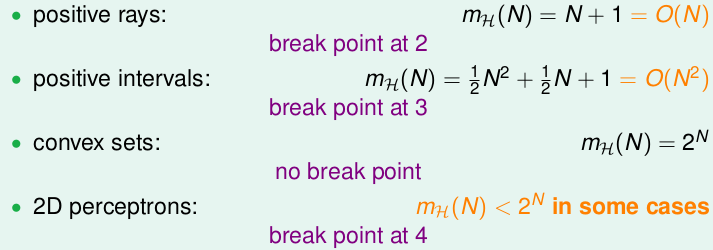

《机器学习基石》系列课程（五）

在第四章中，我们一开始提出来一个问题：Learning好像是不可行的，经过了证明，我们确定了在Hypotheses Set是有限的时候，Learning是可以做到的。然而，在实际的学习任务中，假设空间中往往存在无限多个假设h，那么在这个时候会发生什么呢，Learning能够进行这个结论在这种情况下还能成立吗？
<!-- more -->

## Recap and Preview
现在我们先对整体做一个回顾：如果我们假设Hypothesis Set H中假设h的数量是M，那么如果在我们拥有的数据量N是足够多的时候，根据霍夫丁不等式，我们知道任意一个在H中的一个h，它的Ein(h)和Eout(h)是大概相等的，或者说是相差不多的。如果我们找到了一个h，Ein(h)和0很接近，那么也就可以保证Eout(h)也和0接近，由此我们知道Learning是一件可能完成的事情。
在这个过程中，有两个核心的问题：

1. 需要保证Ein(h)和Eout(h)非常接近。
2. 我们能够找到一个h，使Ein(h)和0非常接近。

当然，当M是有限的时候，1是能够保证的，但是对于2却不一定能够做到（h数量比较少，不一定能找到一个使Ein(h)逼近0的h）。那么我们就需要一个有很多的（或者说数量是无限的）h的Hypotheses Set。那么一定能够找到一个h，令Ein(h)和0逼近。然而与此同时，坏事情发生的概率却增大了（坏事情定义见四，简单来说就是Ein(h)和Eout(h)相差很大的事件)。当M是一个无限大的数的时候，那么现在的状况可以说是糟糕透了，我们好像根本不能说明Learning能够进行。

现在我们考虑该怎样接近这件事，首先我们还是要看一看Ein和Eout的霍夫丁不等式：

  

我们接下来要做的是尝试寻找一个多项式mh替换M，如果我们能够将这个无限大的M限制在有限的mh以内，由此Learning便为了可能实现的事情了。

  

## Effective Number of Lines
我们首先考虑M这个数是怎么来的。
我们在使用演算法自由自在地选择h的时候，可能会遇到一些BAD DATA，这些BAD DATA会恶化我们的选择。我们在计算这些BAD DATA发生的概率时使用了union bound方法，即将每一个BAD都or了起来，也就是最终的BAD概率是由每一次BAD概率的加和得到的。这也就意味着我们有一个前提假设是“所有的BAD事件都是没有重叠的”。然而当我们考虑M是无限的时候，union bound是否会失败呢？

  

事实上，就像上图那样，有很多的BAD事件是有重叠的部分的，尤其是那些Eout相近的假设h，此时我们使用union bound来计算BAD的概率，显然是将这些重叠的部分不止一次地重复计算了，由此也导致M变大了。如果我们要计算实际上的M，就要知道这些重叠的部分有多大。

现在我们设定我们的Hypotheses Set H是二维平面内的直线，那么我们可以知道在H中存在无限条直线。如果我们从我们已有的数据的角度去看这些直线，那会有多少条呢？我们可以设定数据点在直线上方时我们可以将数据标记为o，数据点在下方可以将其标记为x。
如果我们只有一个数据点，那么H中只有2条直线，因为从数据点的角度来看，只有一条直线能让它变为o状态，另一条将其变为x状态。如果我们有两个数据点呢？通过枚举，我们可以知道会有4条直线。如果有3个点呢，最多就会有8条直线，然而，可能会出现三个点共线但是同种颜色不相临的情况，这时就不存在一条直线可以将数据点进行标记，也就是所3个点的时候最多是8条。同理，4个数据点的时候由于存在不能区分的情况，只存在14条直线。
实际上，我们可以轻易地推论出，数据量N和有效直线数量的关系是：effective(N) <= 2 \*\* N。现在如果我们能推论出：

1. effective(N)可以替代M。
2. effective(N)远远小于2 \*\* N。

我们就可以说Learning is possible！

## Effective Number of Hypotheses

现在我们使用Dichotomies(二分类)的概念来继续我们的推论。我们设现有的Hypotheses Set H中是一些直线，H中的每一条直线都能够将点标记为‘o’或者‘x’。Dichotomies的Hypotheses Set是经过上述每一条直线标记后的每一点的状态序列(ooxxx..., etc, depend N)。上面我们经过了讨论，可以知道虽然H是无限的，但是我们的Dichotomies H的上限是2 \*\* N。
我们现在使用Dichotomies H的大小来衡量（或者说替代）M。不过现在它的大小现在还是依赖于我们已经选择好的数据集x1, x2, x3, ...。这在以后的证明过程中可能会带来一些麻烦，所以我们从数据集合整体中任意选择N个数据点，取Dichotomy H的大小的最大值作为M的替代着mh(N):

  

我们将其称为Growth Function（成长函数）。它一定是有限的，上限是2 \*\* N。我们现在看如何计算成长函数：
1. 一维的点
一种情况如下图所示：

  

mh(N) = N + 1，此时当N很大的时候mh(N) << 2 \*\* N；
另一种情况：

  

此时可以计算：mh(N) = 1 / 2 \* N \*\* 2 + 1 / 2 \* N + 1 << 2 \*\* N(when N large)。
2. 凸形集合（convex sets）
如果是凸形的封闭曲线的集合对点进行二分类标记，设在曲线内部的点是o，外部的点是x，此时的成长函数是多少呢？

  

假设我们有一系列的点x1，x2，...，xn。我们使用Convex曲线将其分为两部分：

  

我们可以计算得到mh(N) = 2 \*\* N。

## Break Point
上文中我们举出了几个简单的例子观察成长函数：

  

如果现在我们使用成长函数mh(N)替换M：

  

那么，当mh(N)是多项式的时候，那么是可以替换的，此时<=符号是成立的，但是如果mh(N)是指数形式的，就不能肯定了。我们的问题是对于平面的假设或者一般的Perceptrons，mh(N)是多项式的吗？

我们知道对于2D perceptrons，其grouth function的上界是2 \*\* N，也就是从某一个点开始，有一些情况是无法分类的，我们把这种点称为Break Point。从Break Point我们可以看到一些希望。

  

通过对Break Point进行观察，我们可以提出一种假说：成长函数的成长速度和Break Point是有关系的，都是和N的（break point - 1）次幂方有关的。如果我们真的能够证明这件事，我们只要找到了Break Point，我们就能证明Learning的可行性！

> 文章内容和图片均来自“国立台湾大学林轩田老师”的《机器学习基石》课程！

--- END --- 