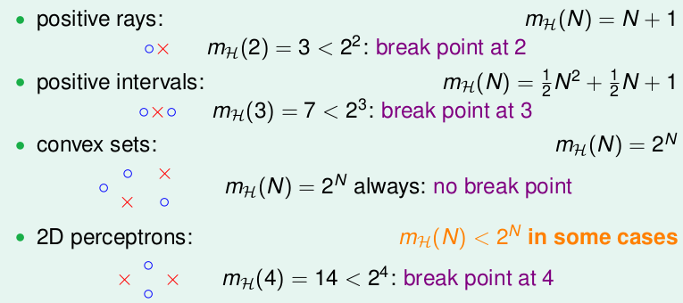
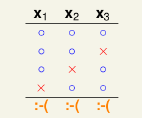
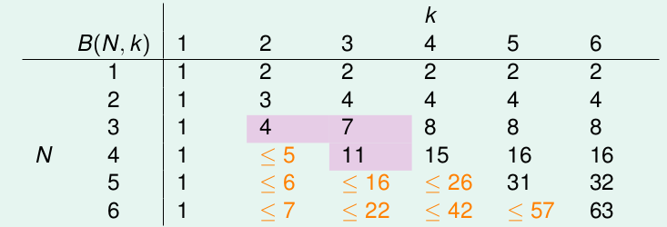
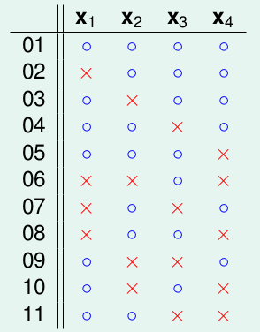
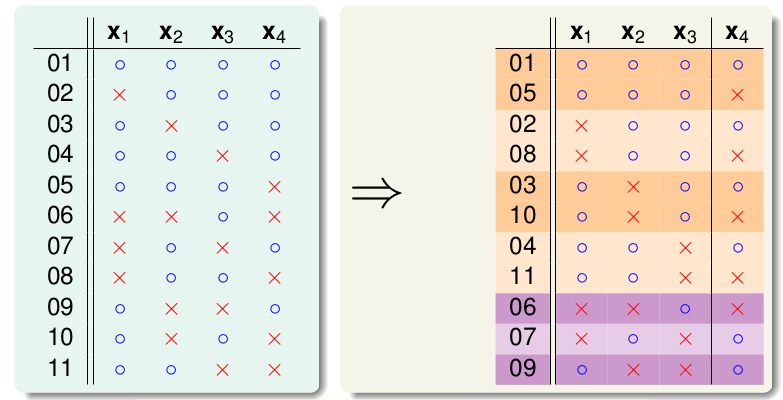
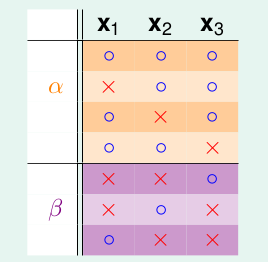
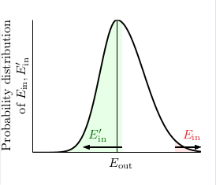
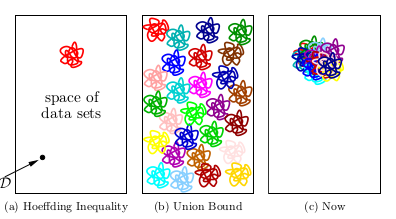
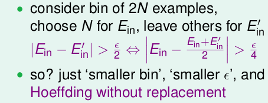

《机器学习基石》系列课程（六）

举一反三！

<!-- more -->

## Restriction of Break Point

在上一章里，我们曾经假设Break Point和增长函数有一定的数学关系，除此之外，我们也讨论过了四种情况下的Break Point：

  

对于上图中的前三种情况是比较容易理解的，在2D perceptrons情况下，我们不知道其增长函数是什么，我们只知道其一个上限是2 \*\* N，但是由于我们知道有如图4个点的分布是不能被shatter的，故此，我们知道它的Break Point是4。并且，很容易可以推论出，当某个成长函数的Growth Function的Break Point是k的时候，k+1，k+2， ...都是它的Break point。

现在我们假设一种情况：我们有一个增长函数，它的Break Point k为2。那么我们能够从这推论出什么？

1. 当点的数目N为1的时候，点是可以被完全shatter的，因此增长函数mh(N) = 2。

2. N = 2，根据定义，增长函数的最大值是要小于4的（因为Break Point存在，对于大于等于k的点是不能被shatter的，最大的可能只能是3）。

3. 如果N = 3呢，我们可以通过穷举得到增长函数的数值为4。就像下图中那样，在四种情形以后，添加任意一种情形，都存在2个点能够被shatter，违反了定义：

   
  

从上面一个简单的假设来看，当k=2时，N=2时，增长函数mh(N)和k相差不大，当N=4是，看起来好像相差越来越大了。我们推测，Break Poin很大程度上限制了mh(N)，当然N是大于k的。

那么，如果我们对一个增长函数，给出了它的Break Point k，我们能够求出在k的约束下的mh(N)的上界是多项式的呢？

## Bounding Function: Basic Cases

现在，我们使用Bounding Founction B(N, k)来描述Break Point为k的mh(N)的上界。实际上就是看有多少个二分类，其满足任何长度为k的子集都是不能被shatter的。

现在我们有了一个新的目标：

  

现在计算N和k较小的时候B的数值：

 

上图是最终的计算结果，但是其计算过程中主要分为了以下4个过程：

1. 当k=1时，对于任意数目的点，只能有一种情况，如果多出了一种，那么就不满足Break Point的定义了。
2. 当k > N时，所有的点都能够被shatter，那么就是2 \*\* N。
3. 对于k和N相等的情况下，只要在所有的情况下删除一种就能满足定义，因此是2 \*\* N - 1。
4. 对于其他的下三角的部分（也是最重要的部分），我们可以经过一个巧妙的归纳证明，归纳出其与上一行的两个元素存在关系。

## Bounding Function: Inductive Cases

在上一节中，我们对第4种情况的归纳没有详细的描述，在这一节中给出其具体的归纳过程。

我们的归纳从B(4, 3)开始。我们首先推测B(4, 3)能不能用几个B(3, ?)的数值来代替？看起来没有头绪，实际上我们可以使用计算机编写一个程序来穷举B(4, 3)这个情况：

  

可以得到图片上的几种情况，对于这些凌乱的分布我们尝试重新整理，将除去最后一个的相同的放到一起：

  

前8个是成双成对的，只有后3个是孤零零的。那么我们可能有这样的推测：

  

那我们看一看α + β是什么样子的：

  

因为α + β是B(4, 3)的一个子集，那么α + β也是不能被3shatter的。从而：

  

对于上一个图中的α ，它和x4组合后，我们说它不能被3shatter，那么α就不能被2shatter，因此

  

最终，我们将其组合到一起：

  

我们能够作出推论：

  

并经过归纳证明这一结果，换一种表达方式：

  

其上限是poly(N)。我们只要有一个有限的Break Point，我们就能用多项式的上界限制增长函数

## A Pictorial Proof

我们这一段时间的工作，一直是试图将霍夫丁不等式中的M替换为mh(N)，然后再看看能否替换成多项式。实际上，这并不是简单的替换就行的，我们的替换实际上会是这个样子的：

  

这是一个比较复杂的证明过程，我们可以对添加这些参数做一个简单的证明：

步骤1:

我们将Eout替换为Ein'

  

因为Ein是有限的，Eout是无限的，我们想将这个罪魁祸首替换掉该怎么办呢？

  

我们可以将验证集D’上的Ein’替换Eout，如果一个假设h，其Ein和Eout的差值很大，那么有很大的可能性Ein和Ein‘的差值也是很大的。当然，为了严格添加了两个1/2（不懂啥意思）。

步骤2:

我们上一部替换Eout，实际上是为了将空间简化为有限多种。我们使用Ein‘替换Eout之后，现在的增长函数实际上收到已有数据集D和验证集D’的影响。根据Break Point的思想，我们只需简化我们的假设空间为H(x 1 , . . . , x N , x 0 1 , . . . , x 0 N )|就可以了。

  

如图，hoeffing不等式是说坏事情发生的事很少，而当我们简单的使用union bound就会变成图二那样，现在，我们就是将坏事情都聚在了一起，那么现在我们就可以使用union bound计算了。因此我们使用mh(2N)。

步骤3：

  

我们现在做的事情有点像从有2N个球的瓶子中抽取N，用N来计算Ein，剩下的用来计算Ein‘，就像抓出N个出来，来比较其和所有的。那么，在之前差1/2，后者就差1/4。（部理解*——#）

  

最终我们通过引入增长函数的到了一个全新的不等式Vapnik-Chervonenkis (VC) bound:

  

现在，我们就能证明2D Perceptron是能够Learning的（因为Break Point是4， 增长函数的上界是N \*\* 3）。

> 文章内容和图片均来自“国立台湾大学林轩田老师”的《机器学习基石》课程！

--- END --- 