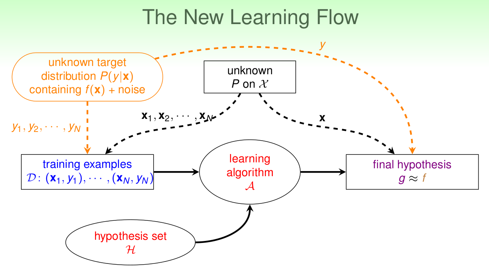
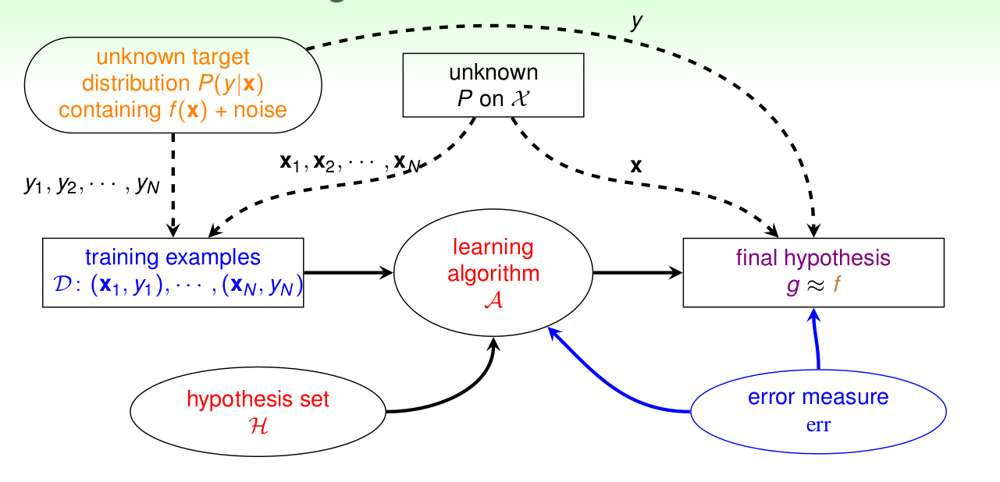

## 08 Noise and Error
我们在之推到验证VC Bound时，做了一些假设，其中就包括数据中是不包含噪音的（Noise）。如果我们的数据中包含错误和噪音（真实的情况下往往是这样的），那么会发生什么？
<!-- more -->
### Noise and Probabilistic Target
实际上我们在学习PLA算法时就讨论过Noise，当时我们说如果数据是线性不可分的话，我们的PLA算法就不能停止，我们可以把这些导致不能线性可分的点看作是Noise，因此我们使用Pocket算法来解决这种问题。
Noise同时存在于x与y：仍然是银行信用卡发放问题，有可能是用户提交信息写错了，也有可能是专家标注过程标注错了，甚至可能两个专家对同一个用户的数据给出了不同的态度。当然，在其它具体的场景中Noise和Error产生的原因会有其特定的因素。
那么我们之前讨论过的VC Bound在Noise的条件下还能作用很好吗？
在回答这个问题之前，我们回忆在推导VC Bound的过程中最关键的是什么：实际上在我们证明时，都是从瓶子中抓出一把球来估计橘黄色球的数目，如果有Noise，那么橘色的弹珠就是犯错误的地方（把每个弹珠看作是x，颜色就是假说的预测和f的实际结果是否相同）。

  

如果现在瓶子中有一个球的颜色是不停在变动的，不过瓶子中球颜色在整体上还是符合某一种分布，我们在估计的时候可以记录抓出时所有球的瞬时颜色，实际上仍然能够做到对橘黄色弹珠的估计，只不过现在不是一个确定的估计，而是一个概率估计。
对于VC Bound，我们仍然能够使用会变色的弹珠这种情况再推导一次，如果满足x的分布是P(x)且独立同分布(i.i.d.)，y按P(y|x)独立同分布，那么能够保证：即使有噪音，VC Bound还是能够表现的很好，之前的证明仍然是成立的。
我们将p(x|y)称为目标分布，可以看作是理想的和一些噪音的组合。同样对于没有噪音的，我们可以将它看作是特殊的p(y|x)的分布。
现在我们的Learning流程可以如下表示：

  

VC Bound仍然可行，同时，我们的Pocket算法也能得到解释：我们尽量让Ein越小越好，在有噪音的前提下仍能够让Ein与Eout大致相等，也就可以学习到东西。

### Error Measure
我们现在看看我们衡量Error的方法：我们之前一直在看g和f是否相同或者接近。我们使用Eout(g, f)来衡量错误，我们考虑的是:

1. 没有见过的数据。
2. 这些数据是可以一个个验证的。
3. 我们的任务都是分类问题。

很多时候我们衡量错误的时候都能够一个点一个点来计算，我们把这种称为pointwise error。我们衡量错误有很多方式，有两种重要的方法，其一是用于分类的01错误（上面的）；另一个就是squared error，一般用在回归问题，来看和目标距离的远近。
ideal mini-target是由p(y|x)和err同时决定的，pointwise error通常取最大的P(y|x)，而平方误差通常取的是期望值。现在我们引入了error measure，我们就能衡量g的好坏了，现在的Learning Map如下：

  

### Algorithmic Error Measure
对于不同的任务，错误衡量的具体参数会有不同。而这种不同来自于两种不同的错误会带来不同的后果。错误可以分为false accept和false reject。前者是本来是错误的却将其判定为正确，而后者则是将正确的判定为错误。
对于不同的实际系统对这两种错误的承受能力不同，比如安全部门的机密档案门禁系统，可能不能承受false accept的错误，因此可以将其权重调的大一些。相反，某些热舞对于false reject的承受能力差，则需要将犯这种错误的惩罚增大。
在计算错误的时候，能够获得正确的err是最好的，但是实际上我们很难得到真实的error，这是我们往往需要一个友好的方法去接近这个error。
### Weighted Classification
我们需要对不同的error添加不同的惩罚，此时可以选用virtual copying方法：将坏的点复制weight遍（模糊）！
