《机器学习基石》系列课程（九）

我们一直在讨论分类问题，并利用分类问题推导了VC Bound以及Learning的可行性问题。Learning任务中也存在很多输出空间是连续的情形，实际上VC Bound同样使用在这些问题上，这一节讨论线性回归问题。
<!-- more -->
## Linear Regression Problem
在我们讨论信用卡发放问题时，我们一直以来的输出都是是或者否的输出空间，如果我们在解决这个问题时，要求输出是一个人的信用程度，我们将根据这个信用程度来决定是否发放信用卡的时候，我们将要解决的问题就是回归问题。
那么我们的Hypothesis Set应该是什么样的，才能输出连续的内容呢？我们可以考虑为每一个维度的输入属性乘以权重，最终我们找到一个合适的权重向量来实现对信用的预测：
```
# 设输入x为
x = (x1, x2, x3, ..., xd)
# 权重向量w为
wT = (w1, w2, w3, ..., wd)
# 那么
y about= sum(wi * xi) (i from 0 to d)
# 转换为向量运算：
h(x) = wT * x
```
上面的h(x)和Perceptron是很类似的，区别是后者有sign函数，将每个数值取为了正负1。
那么Linear Regression在空间中是什么样子的呢？在二维空间中，它是一条直线，而在三维（或高维）空间中，则是一个超平面。我们的Learning任务，实际就是在寻找这条（个）直线（超平面）。

<div align=center> 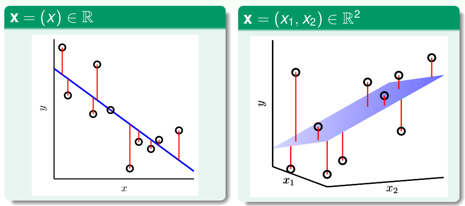 </div>

在回归问题中，一般使用平方误差（Squared error）作为Error的衡量方法，即数据在Learning后输出的结果和实际结果差值的平方。这个方法可以同
时用在Ein和Eout上。Learning的过程就是最小化这个Squared Error的过程。

<div align=center> 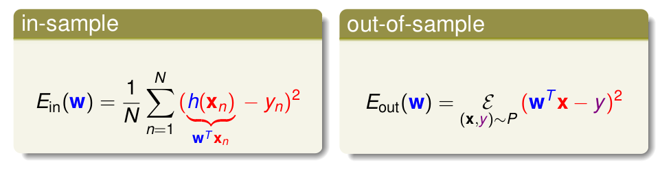 </div>

## Linear Regression Algorithm
在求解Regression问题时，实际是最小化Ein(w)。Ein是w的函数，它包含x和y两个向量参数，首先我们将其转化为矩阵表示：

<div align=center> 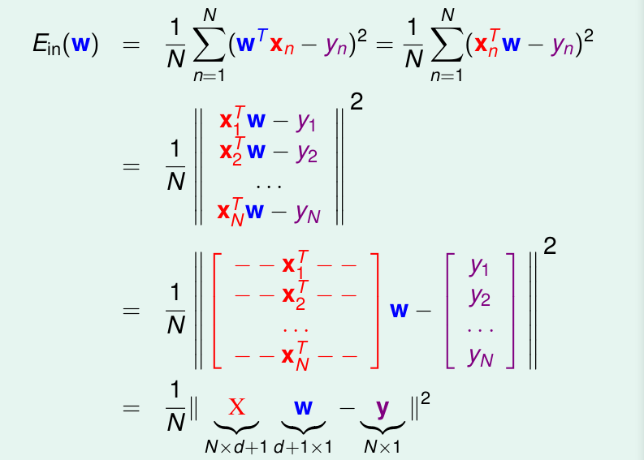 </div>

Ein(w)实际上是连续的凸函数，也就意味着其有最小值，由高等数学可知，在最小值点，Ein(w)的梯度为0，我们找到了这一点的w：wlin，我们也就解决了问题。

<div align=center> 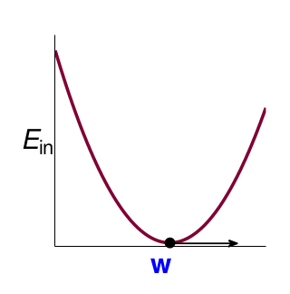 </div>

我们现在求解Ein(w)的Gradient：∇Ein(w) ，将平方项展开，并将一些系数用简单的A、b、c表示：

<div align=center> 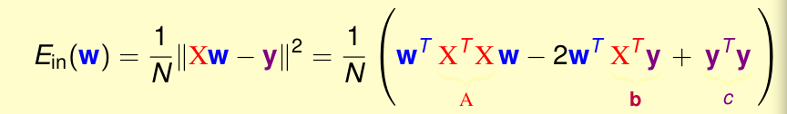 </div>

求Ein的梯度，也就是求w的导数。如果w是一个变量，那么容易求解：

<div align=center> 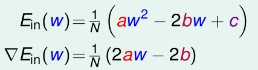 </div>

当w是一个vector时，实际上在求解之后和w是变量的时候具有相同的形式：

<div align=center> 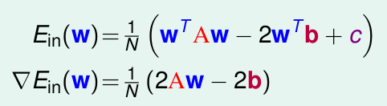 </div>

我们现在的任务就变成了求Ein梯度为0时的w了：

<div align=center> 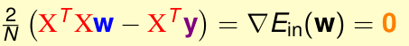 </div>

如果X是可逆的就很容易，通过在等式两边乘以逆矩阵，我们就能够得到唯一的解(大部分情况都是可逆的，因为数据N远大于矩阵维度d+1，否则我们可以使用伪逆矩阵pseudo-inverse，很多软件都实现了这个方法，使用pseudo-inverse求解）。如果X不可逆，那么就会有很多解：

<div align=center> 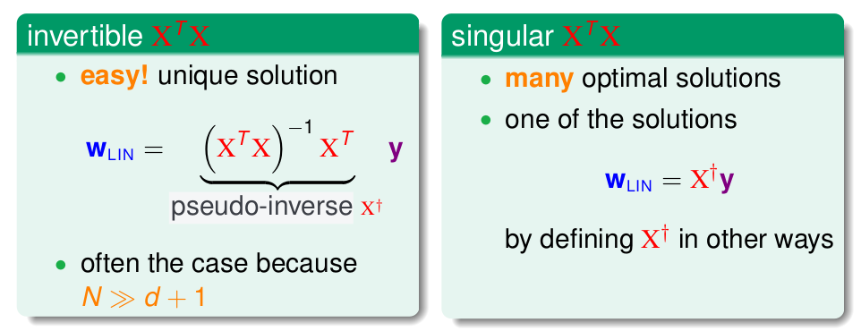 </div>

我们用X+表示pseudo-inverse，那么最终通过计算这个伪逆矩阵，就能得到需要的权重向量：

<div align=center> 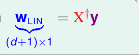 </div>

只要我们使用好的求解pseudo-inverse矩阵的方法，求解最优w的过程就很简单！

## Generalization Issue
上面的Linear Regression算法看起来很简单，可能有些人会产生疑问：这算是机器学习吗？因为他没有看到随着使用数据一步一步优化的过程。
实际上如果我们仔细推导了求解pseudo-iverse矩阵的过程，我们仍然能够看到这个逐步优化的过程，只不过现在它们都被封装好了，我们感觉很简单就计算出来了。所以我们仍然可以说这是一个Learning的问题：我们能够获得一个很小的Ein，由于问题有一个有限的VC维度，我们能够保证Eout和Ein大致相等。

事实上，我们可以利用一种比VC Dimension更简单的方法来证明这个问题：通过比较Ein的平均和Eout的平均。当然，这里只会提到其中重要的几个步骤（或思想）：

我们将求得的Wlin代入，来化简Ein：
<div align=center> 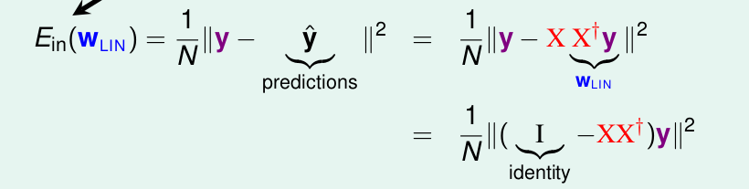 </div>

我们将XX+称为帽子矩阵（hat matrix H），那么化简以后，Ein取决于帽子矩阵和y。
我们从几何学的角度来看这个问题：

<div align=center> 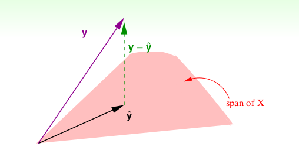 </div>

现在我们假设我们待解决的问题是一个N维空间的问题：其中，ŷ都是我们求得的结果，而y是实际的结果。而令Ein最小化就是让y和ŷ最小。当前我们还不知道最好的w在哪，因为ŷ=Xw，那么我们将所有的w和X计算乘积以后会展开成一个超平面（上面粉色部分），我们让Ein最小只需要让ŷ是y在这个超平面的投影即可，当然我们还需要考虑ŷ的长度，但是很容易知道只要y-ŷ垂直与这个超平面的即可。那么帽子矩阵H就是把任何向量y都头应到这个超平面上，而I - H就是求y - ŷ。

如果我们计算（I-H）的迹 trace(I - H)，可以得到结果是N - (d + 1)，其物理意义是y-ŷ的自由度。

如果现在不是理想状态，而是包含Noise：

<div aling=center> 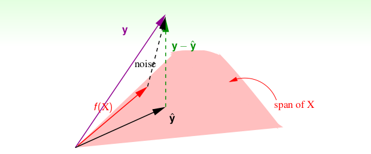 </div>

此时：

<div aling=center> 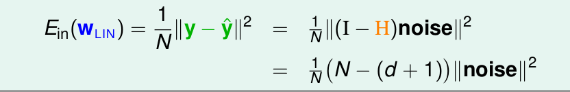 </div>

我们就能得到Ein平均的情况，同理我们也能计算Eout的平均，只不过很复杂。

<div aling=center> 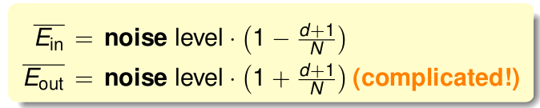 </div>

我们此时可以画出Ein和Eout的平均的曲线：

<div aling=center> 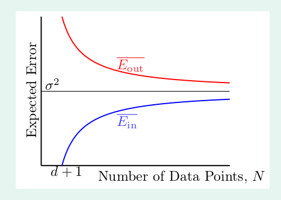 </div>

所以，平均来说Eout和Ein的差是2 \* (d + 1) / N。当N够大Learning是能够进行的。

## Linear Regression for Binary Classification

我们已经学习过线性分类问题，其表示形式和回归问题类似，区别在于其使用了sign函数，对于分类问题，我们的目标是找到一条最优的直线（分类超平面），然而解决这个问题往往是NP问题。
现在我们学习了线性回归分析，通过前面的求解，我们知道这是一种高效的方法。既然分类问题的输入空间是{-1, +1}，那么能不能使用回归方法来解决分类问题呢？
直观上看是可以的，对于-1的类别，我们的回归方法的输出可能是一个负数，或者说当输出是负数的时候我们将其看作是负类；相反，在输出正的时候可以看作正类。为了深入解释这个问题，我们现在观察两种问题的Error的不同。
对于分类问题，我们往往使用pointwise的方案，而回归问题一般是平方误差，这也就导致了前者在数学上的表现是一段段梯形的表示（不会平滑连续），而后者则是平滑的凸函数。

<div align=center> 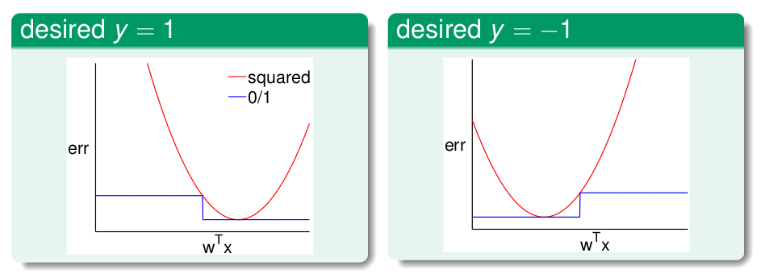 </div>

也就是说，分类的error总是小于或者等于回归的error！由此，我们可以使用Regression求得的最优权重向量wlin初始化PLA或者Pocket算法，然后再由PLA或Pocket进一步找到最优的解，这样就能很大程度上提高效率。

> 文章内容和图片均来自“国立台湾大学林轩田老师”的《机器学习基石》课程！

--- END --- 
