《机器学习技法》系列课程（一）

从本节开始学习SVM！

<!-- more -->

## Large-Margin Separation Hyperplane
我们首先回顾已经学过的PLA和Pocket算法，它们都是找到一条直线（或超平面）将数据点按照类别分开。但是经过PLA或者Pocket得到的目标可能有很多，比如：

 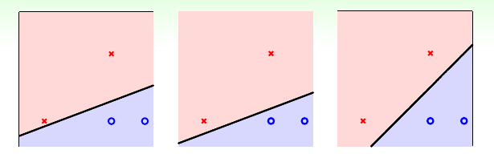 

就像上图那样，每一条直线都是有可能得到的，并且都是分类正确而且满足VC Bound。然而，如果让我们来直观地做出选择，第三图得到的分类直线才是最好的，因为这条直线距离两个种类的距离很平均，可能对于新的数据会具备更好的泛化能力。

为什么说最右边的直线表现最好呢，我们可以有两个角度来解释：
首先我们可以假定在获得每个数据是时都可能存在偏差，也就是我们得到的数据可能在真实的数据的附近，如图：

 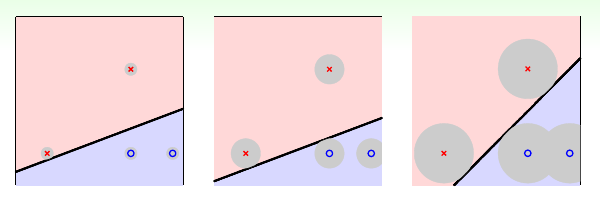 

那么图三能够容忍更多的噪音的发生，那么它的鲁棒性也就更好。相反，对于前两张图，很容易出现overfitting问题。

其次，我们从分类线（超平面）来考虑这个问题。如果我们的最终结果的鲁棒性越好，那么也就说明我们得到的线（超平面）越胖：

 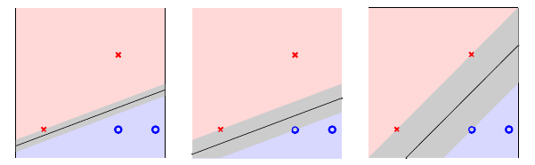 

所谓的越胖，也就是最近的数据点距离直线的距离越大。

因此，我们如果想要选出最好的直线（超平面），就需要在满足分类需要的条件下，让所有点距离其的距离(margin(w))最大化：

 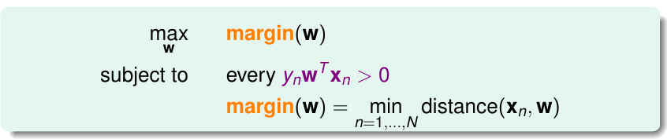 

## Standard Large-Margin Problem
既然条件之一是距离最大化，那么我们该怎样求解距离问题呢？

首先，我们将变量使用矩阵表示，不同于我们之前的习惯，我们需要将w0放在外面作为b，同时也忽略了x0：

 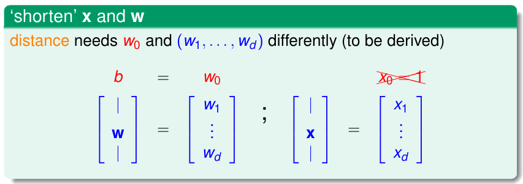 

此时，现在我们的假设空间变为：

  

此时我们的分类线（超平面）满足wTx + b = 0。我们需要任意数据点x到该平面的距离，下面是我们的求解方法：

 ![how to calculate the distance]](mltech01/7.png) 

首先，我们任取分类面上两点x'和x''，带入平面方程我们有：

1. wTx' = -b。
2. wTx'' = -b。

二者化简有：wT(x'' - x') = 0。说明此时wT垂直于分类面。所以，如果我们需要获得平面外一点到平面的距离，我们需要做一个投影运算，即将向量(x - x')投影到垂直于平面的方向，也就是w的方向。

distance = project(x - x') to DIRw

化简得到：

 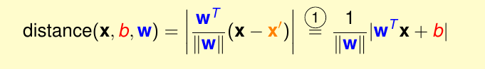 

需要注意的是我们现在使用的超平面是一个分类界面，那么它就会附带更多的一些属性。其中之一是如果用每个点xn对应的类别yn乘以(wTxn + b)，那么结果是大于0的：

 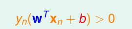 

那么此时我们可以将距离表达式中的绝对值符号去掉了：

 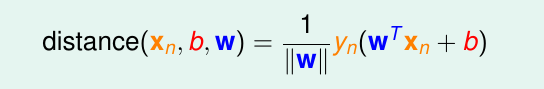 

现在我们的目标变成了如下的形式：

 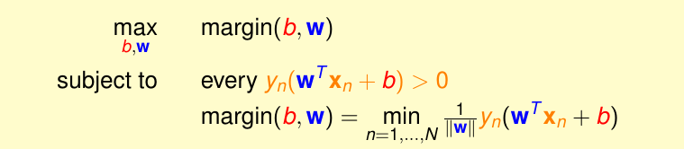 

然而，这个表达依旧很复杂，难以求解，我们继续化简。我们对一个分类面的表达式进行化简，我们知道，对于一个等式来说，方程两边乘以相同的数仍然是成立的，那么，我们可以放缩：

 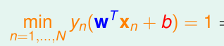 

也就是让距离最近的点满足其结果为1。此时我们所需要的margin(b, w)就变味了1 / ||w||

那么我们现在的目标：

 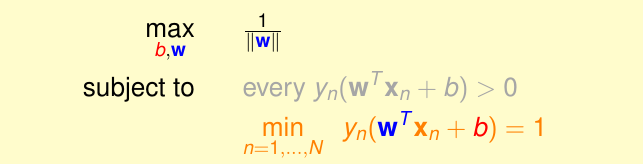 

然而求解依旧复杂，我们继续考虑放缩，我们可以考虑将条件进一步放宽一些，然而我们仍能够证明依然存在最近的点满足等于1。此时，我们将上一个目标变形（将最大化问题变为最小化，即变为倒数，同时乘以1/2为了方便后续的计算，同时变为平方，用来去掉距离的根号），得到了最终的目标：

 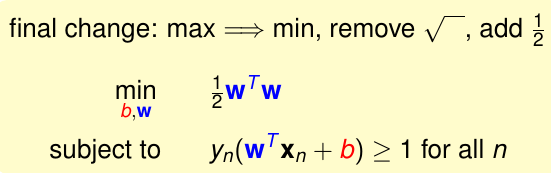 

## Support Vector Machine
上一节中我们得到的表达式我们称之为标准问题。当我们使用其求解一个分类问题时，我们得到的最终的超平面，此时就是SVM。
那么什么是支持向量机（SVM）？

 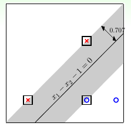 

如上图所示，我们在寻找最胖的分类界面时，需要被方框圈住的点，而没有被圈住的点我们并不需要。我们把这些被圈住的点称为支撑向量（候选者）。而支持向量机（SVM）就是通过这些支撑向量候选者，学习到最胖的超平面。

尽管解决SVM问题并不容易，我们不能利用Gradient Descent等方法，但是比较幸运的是在数学上有类似问题的解决方法：二次规划（quadratic programming）。

然而我们需要对其做一些变换，使其满足Quadratic Programming的标准形式，后者的标准形式如下：

 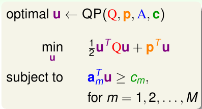 

我们需要知道u, Q, p等，通过变换，有：

 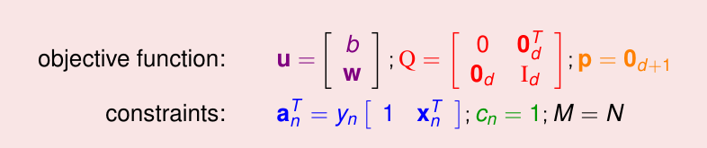 

因此，如果我们需要解决线性SVM问题，需要以下三步：

 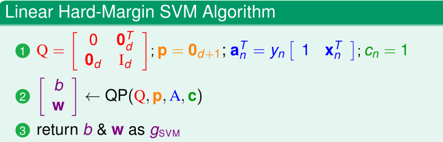 

如果是非线性的，需要做空间变换，将点变换到z空间。

## Reasons Behind Large-Margin Hyperplane
为什么要选择最胖(Large Margin)的分类界面呢？我们从正则化和VC两个方面来看这个问题。

首先我们对比SVM和Regularization：

 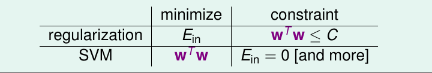 

我们可以看到二者很类似，正则化是最小化Ein而其限制条件是wTw < C；而SVM是最小化wTw，它的限制条件其实也就是Ein=0。二者实际的作用类似，效果相近，所以SVM也可以说是一种weight-decay regularization!

另一方面，我们从VC维度来看这个问题。如果我们选择最胖的线，那么它能够shatter的点也就越少，从而VC维度也就会比原来的PLA更低，从而就可能有更好的泛化效果。

我们考虑演算法的VC维度（之前的VC Dimension是假设空间的Dvc，其和数据无关，而演算法的Dvc和数据有关）：

 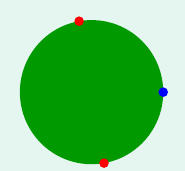 

在圆上有三个点。如果我们线的胖度为0时，实际就是PLA算法，此时dvc=3
如果胖度大于 √3 / 2那么不能找到一条线来shatter3个点。

使用Large Margin的分类面可以降低模型的复杂度，因为dvc更小，具备更好的泛化能力，同时，边界也比较简单，因为我们可能有更好的Ein。

此时如果对于非线性问题，我们的SVM结合特征转换，可能能够得到更好的结果！

> 文章内容和图片均来自“国立台湾大学林轩田老师”的《机器学习技法》课程！

--- END --- 